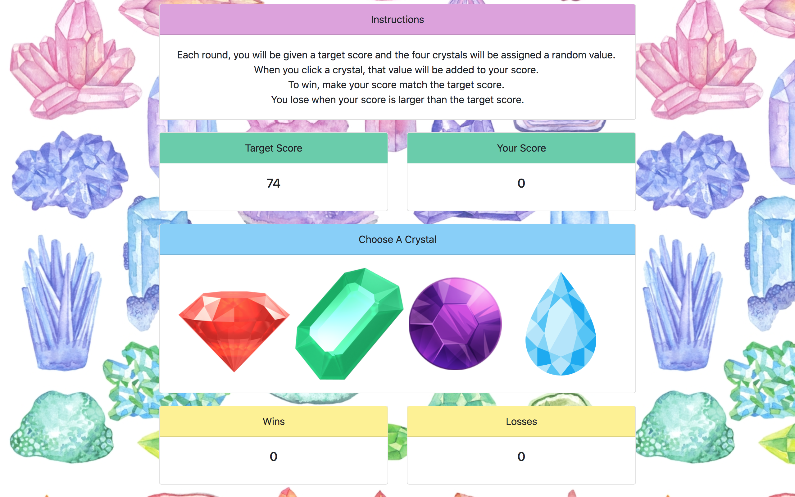

<h1>Crystal Collector</h2>

<h2>Rules</h2>
Each round, you will be given a target score and the four crystals will be assigned a random value.
When you click a crystal, that value will be added to your score.
To win, make your score match the target score.
You lose when your score is larger than the target score.

<h2>Built With</h2>
<ul>
  <li>HTML</li>
  <li>CSS</li>
  <li>Bootstrap</li>
  <li>Javascript</li>
  <li>jQuery</li>
</ul>

<h2>Please visit my deployed project on Github pages!</h2>
https://linalockheart.github.io/unit-4-game/index.html
